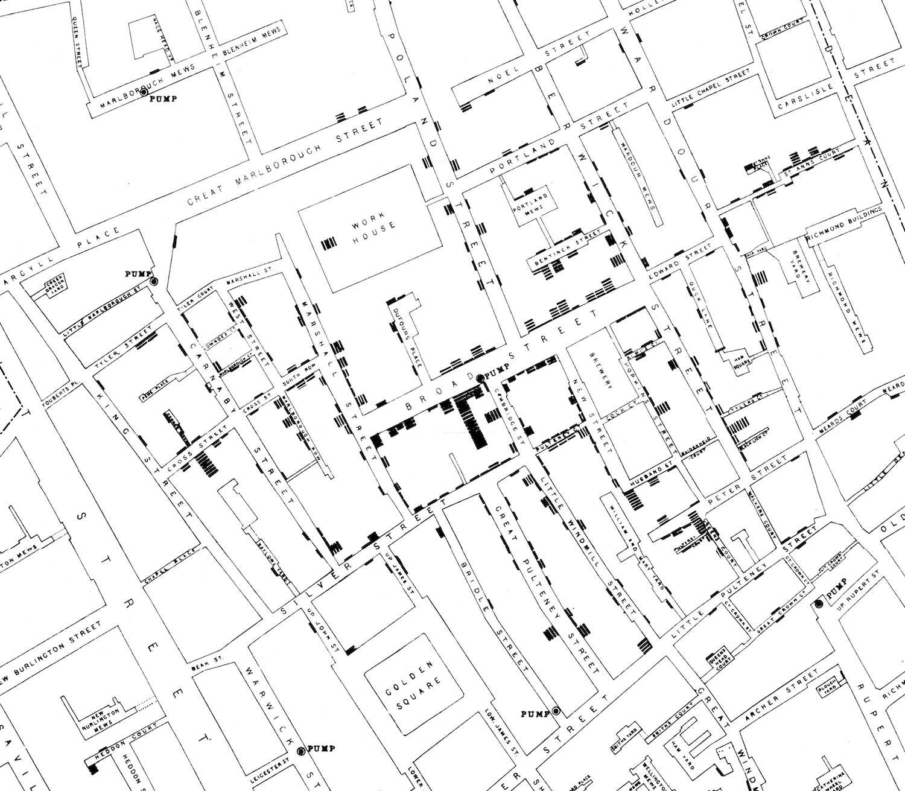
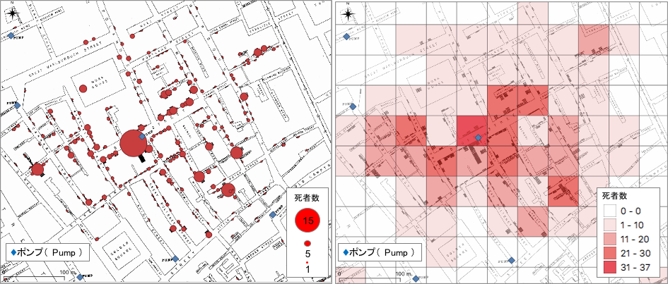

# 地理の学習の意義
- [地理の学習](#地理を学ぶ意義)
- [地理の学習区分](#地理の学習区分)
- [地形と地理情報の学習](#地形と地理情報の学習)

## 地理の学習
　地理では、日本国内や世界の国名、都市名、山や河川の名称等を覚えるのみでなく、地図やグラフを読み取って空間の諸現象について考察します。地図（地理情報）やグラフを扱う技能と、様々な情報を組み合わせて空間の諸現象を考察する力を養う必要があります。例えば、下の図をみてみましょう。下の図は、1854年にイギリスのロンドン（ブロードストリート）で流行したコレラの症例者数を示す代表的な地図です。この地図は、医師のジョン・スノウによって作られ、黒い横棒がコレラの死者を示します。そのほかの情報として、道路、道路名、施設、ポンプ(●PUMPと表記)が描かれています。教材を読み進める前に、この地図で死者の最も多いところと、死者がほとんどないところを比較してみましょう。

*[スノウ・コレラマップ](https://ja.wikipedia.org/wiki/%E3%83%96%E3%83%AD%E3%83%BC%E3%83%89%E3%83%BB%E3%82%B9%E3%83%88%E3%83%AA%E3%83%BC%E3%83%88%E3%81%AE%E3%82%B3%E3%83%AC%E3%83%A9%E3%81%AE%E5%A4%A7%E7%99%BA%E7%94%9F#/media/%E3%83%95%E3%82%A1%E3%82%A4%E3%83%AB:Snow-cholera-map-1.jpg)(Public Domain)を拡大した図*

　図の中央のブロードストリートのポンプの周りに多くの死者を確認できます。一方で、その他のポンプの周りには、それほど死者が確認できません。結果的として、ブロードストリートのポンプがコレラの流行の原因となっていました。ポンプを閉鎖したことによって、感染拡大は収束しました。この地図では、感染が拡大しているブロードストリートにおいて、ビールの醸造所（brewery）の従業員に感染者がいないことも読み取れます。ビールの醸造の工程では、水を煮沸して利用します。従業員は、井戸水の代わりに日常的にビールを飲んでいたと言われています。

> [スティーブ・ジョンソンの感染地図](https://www.ted.com/talks/steven_johnson_how_the_ghost_map_helped_end_a_killer_disease?utm_campaign=tedspread&utm_medium=referral&utm_source=tedcomshare) で動画で解説されています（日本語字幕あり）。その他に、Wikipedia [ブロード・ストリートのコレラの大発生](https://ja.wikipedia.org/wiki/%E3%83%96%E3%83%AD%E3%83%BC%E3%83%89%E3%83%BB%E3%82%B9%E3%83%88%E3%83%AA%E3%83%BC%E3%83%88%E3%81%AE%E3%82%B3%E3%83%AC%E3%83%A9%E3%81%AE%E5%A4%A7%E7%99%BA%E7%94%9F)で、概要が確認できます。

 この事例から、地図が空間的に諸現象を把握することに有効であると理解できます。さらに現代では、地理情報システム（GIS）を用いて、より効率よく空間の情報を分析することができます。下の図は、GISを用いて作成した図で密集度が把握できます。

*スノウ・コレラマップをGISで可視化した図（左:円の大きさが死者数。右:50m×50mの範囲での死者数）*

## 地理の区分
地理の学習は、大きく分けて地図・地理情報、系統地理、地誌の学習にわけられます。

- 地図・地理情報では、地域を読み解くために必要な地図と地理情報の基礎と利用法について学習します。
- 系統地理では、地形、気候、土壌、植生、産業のような空間を構成する主な要素について、一ずつ形態、発達過程、分布等について学習します。
- 地誌では、アジア、ヨーロッパ、アフリカ等のようにスケールを区切って、地域の特性について学習します。

## 地形と地理情報の学習
　地形は空間を構成する最も基本的な要素です。人は古来から、地形をうまく利用して生活を営んできました。地形を知ることで、産業の発達の理解や災害のリスクの軽減に役立ちます。一方で、地形の学習を難しいと感じる人も多く、用語の暗記にとどまってしまうこともあります。また、等高線による地形の判読の困難さも指摘されてきました。そこで、地理情報システムを使って地形を学習を補佐する教材を開発しました。この教材を使うと地形の基礎と地理情報システムの有用性を理解することができます。

#### データソース
本教材で利用したデータは、[Resources]()に別途まとめています。運用者が自作したデータは、無償でダウンロードできます。