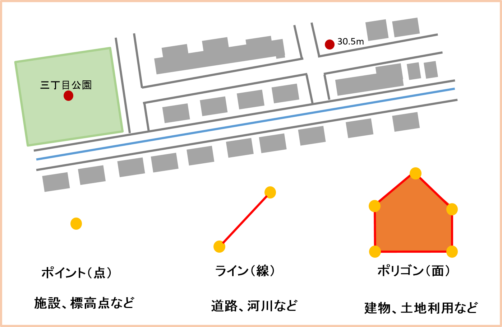
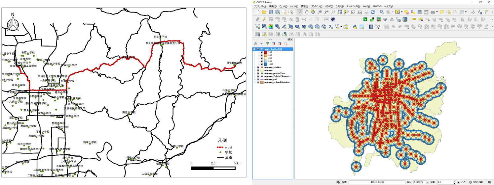
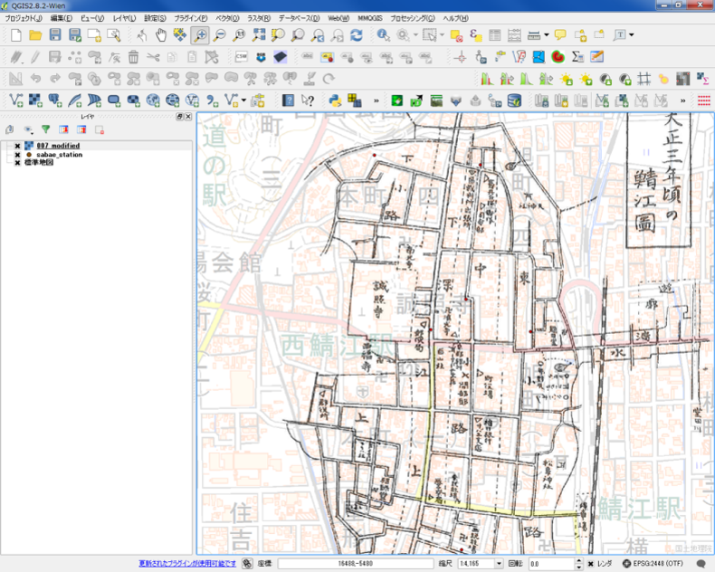
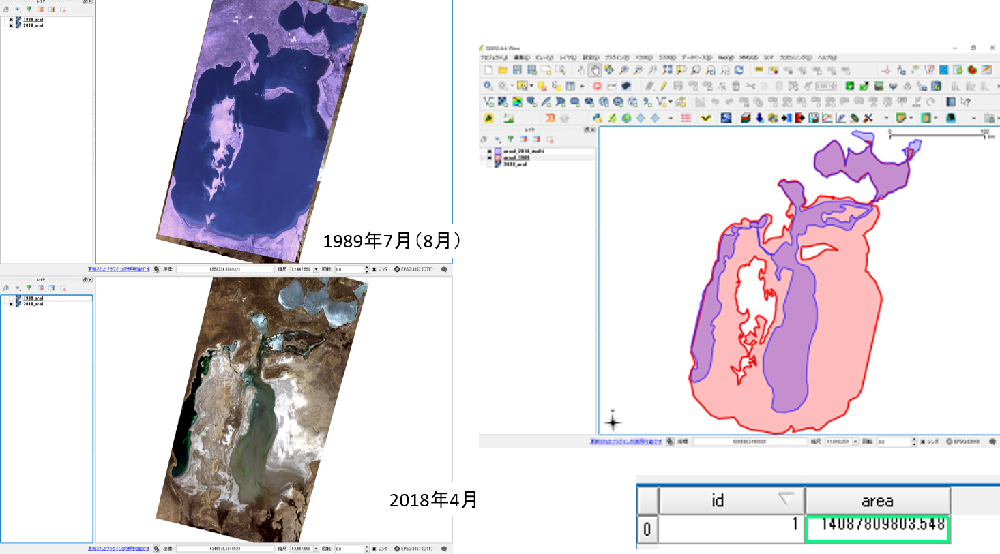
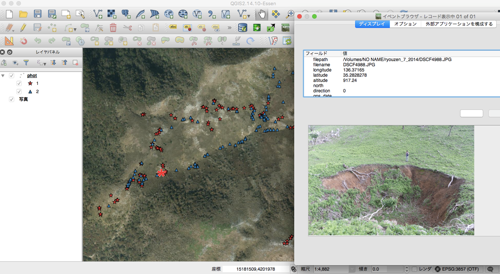

# 地理情報の基礎
　この章では、地理情報について解説します。[GIS実習オープン教材のGISの基本概念の教材](https://gis-oer.github.io/gitbook/book/index.html)をベースにより詳しく解説しています。

- [地理情報](#地理情報)
- [地理情報の活用](#地理情報の活用)

## 地理情報
　地理情報は、地理空間情報、空間情報ともよばれ、人間活動や自然環境に関する情報に、空間上の位置が付与されたデータを指すことが一般的です。地理情報は、**地理情報システム（GIS：Geographic Information Systems）**を通じて、コンピューターで扱うことができ、地図の作成やデータの解析等に用いられます。スマートフォンの普及で、よく目にするマップアプリ、ナビゲーションアプリ、位置情報ゲーム等もGISやその技術を応用したものです。

### GISの特徴と紙地図との違い
GIS上で閲覧できる地図は、紙地図とは異なり、拡大縮小を自由に操作できたり、地物を検索したり、様々な情報を重ね合わせたりできます。紙地図とGISは、「空間を表現、理解するために用いられる」という点は共通ですが、地物の表現方法の点で異なります。地物(Feature)は、道路、河川、建物、境界、線路など、空間上にあるすべてのものを示す概念です。

#### ポイント
- GISは、紙地図を単純にスキャンしてデジタル化したものではない
- GISで作成した地図は、紙地図と同様に利用できるが、地理情報の特徴（空間の表現の仕方）の理解が必要
- 地理情報を扱う技能と地理情報を解釈する思考力が必要

### 地物の表現方法
GISではソフトウェアと地理情報を利用して地図を作成します。地理情報は位置をもつため、ソフトウェア内に座標（経緯度等）で定義されたバーチャルの地球空間を構築することで、その地物が地球上のどの位置にあるかを管理することができます。地物は、座標で管理されるため、ペンで紙の上に地図を書く、紙地図の空間の表現とは異なります。GISでは以下のように、地物をベクトルデータ形式とラスタデータ形式の２種類の方法で表現します。その他に、位置情報以外の情報を付与することができる点も重要です。紙地図では、一つの地物は一つの意味しかもちません。しかし、ベクトルデータは、属性情報とよばれるデータベースと連携して利用することができます。例えば公園を示すデータがあるとすれば、紙地図では公園があるということしかわかりませんが、公園の名称、面積、管理者、緊急時の収容人数などの情報を付与することが可能です。また、複数の公園のデータがあれば、指定した公園を検索したり、公園の周辺の施設等を抽出するなど様々な用途で利用できます。

<iframe width="700" height="510" src="https://https://gg-oer.github.io/maps/leaflet/3-m1.html" frameborder="0" allow="accelerometer; autoplay; encrypted-media; gyroscope; picture-in-picture" allowfullscreen></iframe>

| データ|特徴|代表的なファイル|
|---|---|---|
|ベクトル|・座標値で表現するため拡大縮小による劣化がない ・細かい形状を表現するのに適している ・属性データを複数保持できるが管理が煩雑な場合がある|SHAPE, KML, GeoJSON |
|ラスタ|・解像度は、ピクセルの大きさに依存するため拡大縮小で劣化する ・地形や気温のような連続性のあるデータに適している ・構造が単純なため計算や比較がしやすい(1ピクセルに1つの値を保持)|GeoTIFF, PNG, JPEG |

*ベクトルデータの特徴*

*ラスタデータの特徴*

GISのソフトウェアではデータ（レイヤ）を重ね合わせて地物を表現できます。面の下に点や線を配置すると面で隠れてしまうため、複数のレイヤを用いて重ね合わせする際には、データの形式とレイヤ構造を意識します。

*レイヤ構造*

#### 用途の多様度
地理情報システムは、大きくわけて次の用途で活用でき、1~4を組み合わせ、地理学等の研究に利用したり、地図アプリや位置情報サービスに応用したりされています。

1. 地図、地理情報の作成
2. 地理情報の管理・検索
3. 地理情報の解析
4. 地理情報の配信

## 地理情報の活用事例
ここでは、地理情報の活用事例として、研究分野での活用について、以下1~6の事例を紹介します。

#### 1.最短経路や特定の領域の算出
GISでは、2点間の最短経路の検索や、駅や商店等からの特定の範囲の算出ができる。左図は、[ネットワーク分析]、右図は、[領域分析]にて詳しく解説している。

>国土数値情報の道路、鉄道、行政界のデータを利用し作成

#### 2.建物等の分布密度の可視化
GISでは、領域内の点（商店、駅、公園等）を密度で示すことができる。以下の手法は、[点データの分析]で詳しく解説している。

>国土数値情報の行政界のデータとOpenStreetMapのデータ（右図のコンビニ情報(c)OSM contributors）を利用し作成

#### 3.古地図の位置あわせ
GISを用いることで、データに位置情報を付与することができる。以下はその一例として、スキャナで取り込んだ古地図に位置情報を付与し、現代の地図に重ねて表示したもの。この手法は、[空間データ]の教材で解説している。

>鯖江市オープンデータと地理院タイル（標準地図）を利用し作成

#### 4.環境変化の可視化と面積計算
GISでは、データの作成や、領域に応じた面積の算出ができる。以下は、その一例としてアラル海の領域を作成し、面積を計算したもの。データ作成の手法は、[空間データの統合・修正]、面積計算の手法は、[基本的な空間解析]で解説している。

>Landsat4-5TMとLandsat8のデータを利用し作成

#### 5.標高データから地形情報を算出、可視化
GISでは、標高データを用いて地形を分析できる。地形分析の手法は、[ラスタデータの分析]で解説している。

>基盤地図情報5ｍDEMを利用し作成

#### 6.写真の撮影地点を地図で表示
GISでは、データと外部ファイルを関連して、管理することができる。以下は、その一例として、地点と対応する写真を表示したもの。

### GISの種類と操作体験
GISのアプリケーションには、PCにインストールして利用するデスクトップGISと、Webからのアクセスのみで利用できるWebGIS等があります。無償で利用できるデスクトップGISには、QGIS、GRASS GIS、MANDARA等があり、WebGISには、地理院地図、重ねるハザードマップ、Google Earth等があります。GISの技術は日々進展していますが、現時点で、デスクトップGISは主に、データの解析が得意で、WebGISは地図の閲覧や情報の共有に優れています。次のページでは、WebGIS（地理院地図）と、デスクトップGIS（QGIS）の利用法を解説しています。それぞれの学習目的に応じて選択してください。

#### PC初心者向け
[地理院地図入門へ進む](../3/3-2/3-2.md)
> 地図を閲覧する手法、空中写真を比較する手法、地図データを作成する手法を解説

#### PC中級者向け
[QGIS入門へ進む](../3/3-3/3-3.md)
> QGISの基本操作、地図の作成、地形データの分析手法を解説

#### より深くGISを学びたい方
高等教育向けにGISの基本を解説した[GIS実習オープン教材](https://gis-oer.github.io/gitbook/book/index.html)をご活用ください。

#### データソース
本教材で利用したデータは、[Resources]()に別途まとめています。運用者が自作したデータは、無償でダウンロードできます。