# GISによる地形表現
　等高線による地形の判読の難しさを軽減するために、GISや様々な機器を利用した地形の学習法が提案されています。このページでは、地形の理解に役立つ図法や、機器等について紹介します。

## 平面での地形表現
　地形図では、地形を表現する手法として、等高線が用いられます。等高線は、地表の形状と土地の高さの判読に有効です。一方で、等高線の密度が低い平野部などでは、地形の形状をつかみづらく、また高密度の部分では高さの読み取りが難しい等、読図には特有の技能が求められます。一方で、GISと地形情報を用いることで、地表の形状（地形の凹凸や傾斜）をわかりやすく表現できます。GISでは、等高線をベクトルデータで表現し、地表の形状を各ピクセルの中心点に標高値が入っているラスターデータ（DEM:Digital Elevation Model）として表現することが一般的です。以下では、30mx30mのピクセルごとの値（例えば標高値）を色分けして、地形を視覚的に表現したものを紹介します。また、地形を精細に表現するためには、高解像度（ピクセルの密度を上げる）のデータを用いる必要があります。一方で、高解像度のデータは、その分データ容量が大きくなったり、精細すぎて地形の概観が把握しづらくなる等を考慮する必要があります。

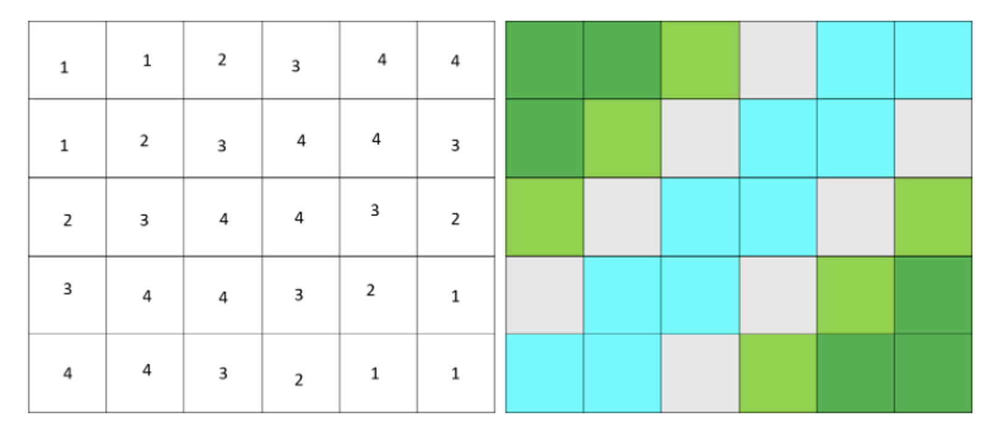

 *ラスタデータの特徴* 
 

### 等高線
等高線は、標高値を線でつないで地形を表現します。GISでは、標高値をもつラスタデータからベクトルデータとして抽出して利用することが一般的です。ラスタデータからの等高線の抽出は、標高値に応じて補間されるため、密な等高線を作成できます。等高線を密にすると地形の概観を把握しやすくなりますが、値は補間によるものなので、細かくみると実際の地形と対応しない部分も生じます。ソフトウェアを用いることで、等高線の値に応じて色分けすることができます。ベクトルデータによる等高線は、ラインごとに標高値や座標値を保持するため、データが重くなりやすく、地形表現に用いる場合は、何メートルの間隔で指定するかを検討する必要があります。

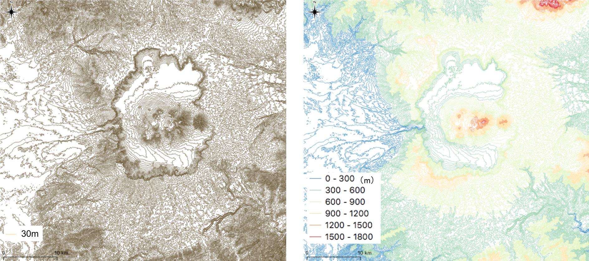

 *等高線による地形表現（阿蘇山とその周辺）* 

### 標高段彩図
GISでは、ラスタデータの持つ値を、一定の範囲で塗り分けて地形が表現できます。配色の方法は、下の図の左のように、値を一定の区間で分けその範囲をぬりつぶす手法、区分した値の間を標高値に応じて線形で補間する手法などがあります。この手法は、高さが把握しやすいものの、地表の形状が分かりづらいことや、地形に応じた分類でないため、同じ地形でも異なる色で表現される場合があります。
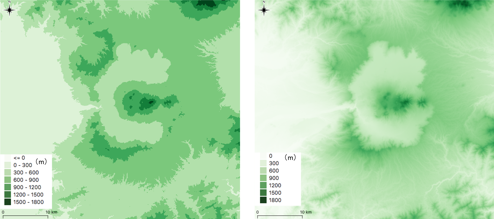

 *標高値による地形表現* 

### 陰影図
陰影図は、ある方向から光をあてたことを仮定し、地形の凹凸に応じて色分けした図です。右のように標高の段彩図等と重ね合わせることで、地表の形状と高さ情報を同時に表現できます。陰影図は、土地の凹凸が理解しやすい反面、急傾斜となる箇所の一部が黒く塗りつぶされてしまう問題があります。
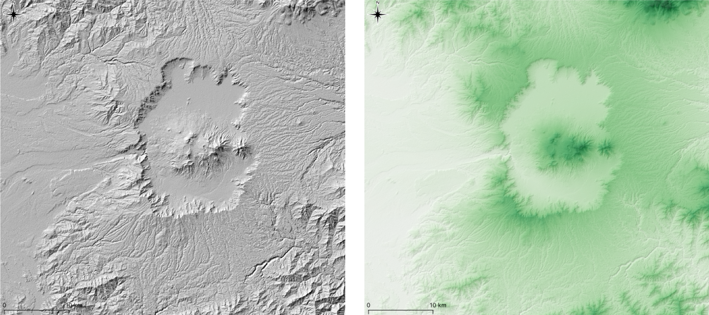

 *陰影図による地形表現* 

### 傾斜量図
GISでは、標高値を利用して、傾斜を計算できます（ピクセルは、間隔が一定のため、隣り合うピクセルの値を利用した計算が可能。）。計算した傾斜の値を利用すると下の図のように地形を表現できます。この図は、傾斜の把握に最適なものの、高さの把握ができないという課題があります。

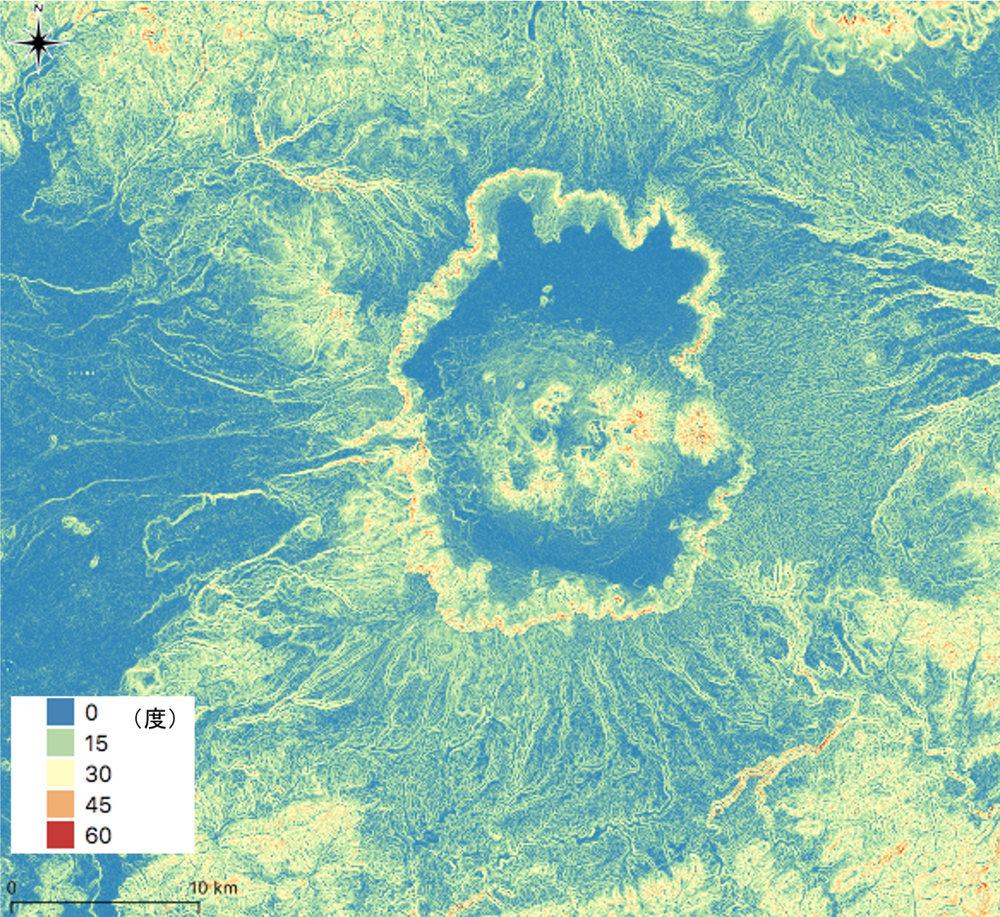

 *傾斜量による地形表現* 

### CS立体図
[CS立体地図](https://www.geospatial.jp/gp_front/csmap)は、長野県林業総合センターが考案した図法です。標高値から算出した傾斜量と地形の曲がり具合を示す曲率の図を複数枚重ね合わせて地形を表現したものです。複数の図を重ねることで、凸地ほど赤くなり、凹地ほど青くなるように、暗いほど急傾斜、明るいほど緩傾斜に表現されます。

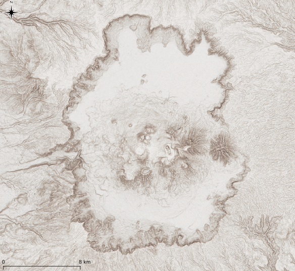

### 尾根線・谷線強調図
尾根線・谷線強調図は、TPI(Topographic Position Index)、傾斜、陰影図を重ねて地形を表現したものです。この図法では、複雑な地形の概観を捉えることを目的に、尾根や谷のどちらか一方を強調した表現になります。閲覧したい地形の特徴に応じて、地図を選定して利用します。

### GISで地形表現を比較する 
上記の図法を下の地図で比較することができます。

<iframe width="700" height="510" src="https://https://gg-oer.github.io/maps/leaflet/4-m1.html" frameborder="0" allow="accelerometer; autoplay; encrypted-media; gyroscope; picture-in-picture" allowfullscreen></iframe>

**※ 各図法には、それぞれ課題があるため、目的に応じて使いわける必要があります。**

### 3D表現、鳥瞰図
空中から地形を斜めに眺めるような地図表現として、鳥瞰図があります。GISでは、標高値から3Dモデルを出力できるため、鳥瞰図を作成できます。3Dモデルは、AR、VR、3Dプリントにも利用できます。
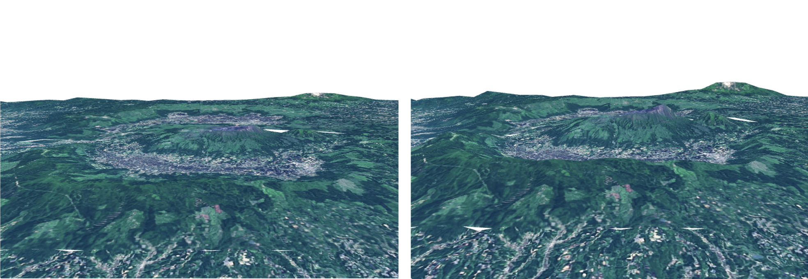

 *鳥瞰図の例* 

## 地形の立体視
地形を立体的に把握する手法として、空中写真を用いた立体視があります。地図の作成に利用される空中写真は、下の図のように一定の割合でオーバーラップして撮影されます。下の図の青とオレンジの範囲の重複する部分は、撮影した地点が異なり、この差を利用し立体視します。肉眼による立体視は、難易度に個人差があるため、できない場合でも問題ありません。
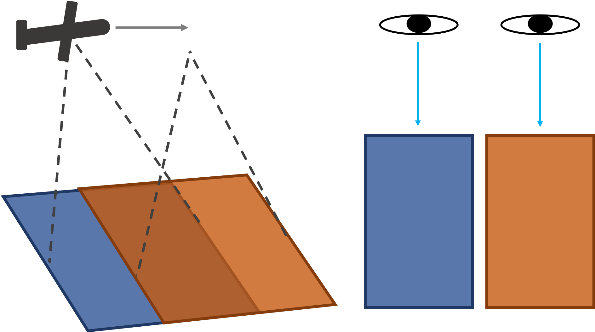

 *空中写真と立体視* 

### 肉眼での立体視
下の写真の赤い丸を基準に、右の写真を右目で、左の写真を左目でなんとなく眺めると立体視ができます。うまくできない場合は、画像の間に間仕切りを設けるとうまくいくことがあります。

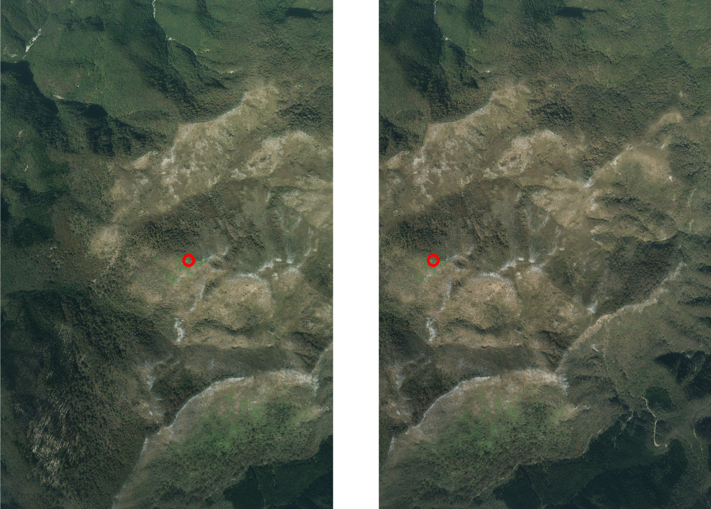

 *立体視の実践（滋賀県霊仙山）* 

> 空中写真は[国土地理院 地図・空中写真閲覧サービス](https://mapps.gsi.go.jp/maplibSearch.do#1)より取得したものに加筆

### 反射実体鏡
反射実体鏡を用いることで、容易に立体視を体験できます。
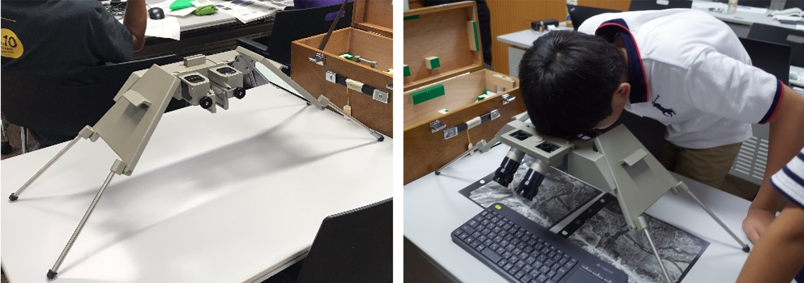

 *反射実体鏡* 

### アナグリフ
赤青のフィルムメガネ等を用いることで、低コストで実体視ができます。手元に赤青メガネがあれば、下の地図から、アナグリフを体験できます。
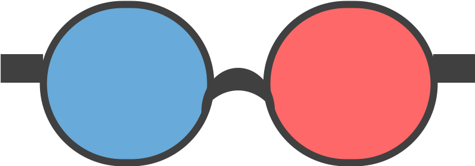

 *アナグリフ用の赤青メガネのイメージ* 

<iframe width="700" height="510" src="https://gg-oer.github.io/maps/leaflet/4-m2.html" frameborder="0" allow="accelerometer; autoplay; encrypted-media; gyroscope; picture-in-picture" allowfullscreen></iframe>

### VRビューワ
3Dモデルを利用して、VRビューアやスマートフォンでVRとして地形を表現することができます。下の図では、ビューワーを通じて仮想空間に没入することができます。
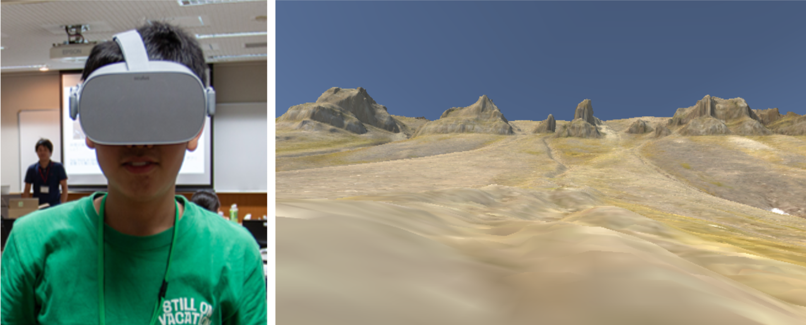

 *VRの例* 
 

### AR
3Dモデルを利用して、スマートフォンでARとして表現することができます。
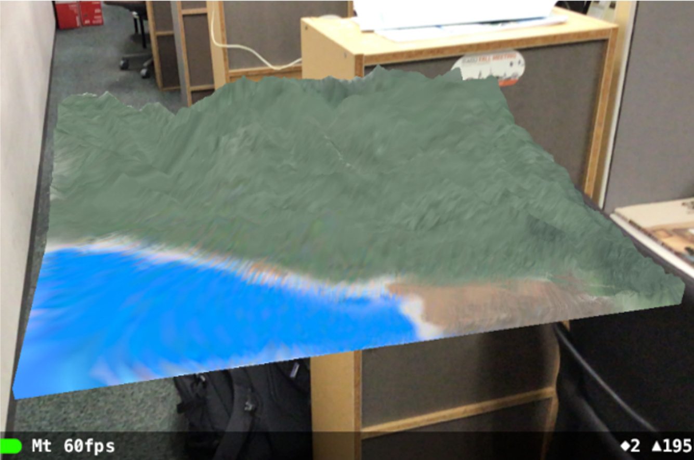

 *ARの例* 
 

## 地形模型
### 厚紙等による模型
等高線に沿って切り抜いた、厚紙やダンボールを重ねあわせることで地形模型を作成できます。
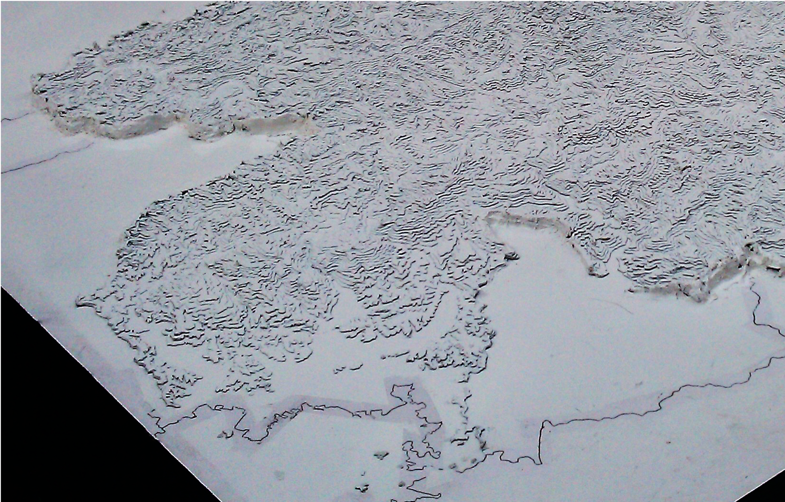

 *地形模型の作成例* 
 

### 3Dプリント 
地形データの標高値を用いて作成した3Dのモデルは、、3Dプリンタで出力できます。3Dプリントは、プリンタの種類や樹脂等によって、造形手法が異なります。以下の図は、ABSという樹脂を熱で溶かして、一レイヤずつ積み上げて作成したもです。3Dプリントでの地形模型の出力については、[GIS実習オープン教材](https://gis-oer.github.io/gitbook/book/materials/equipment/3dprinter/3dprinter.html)を参照してください。
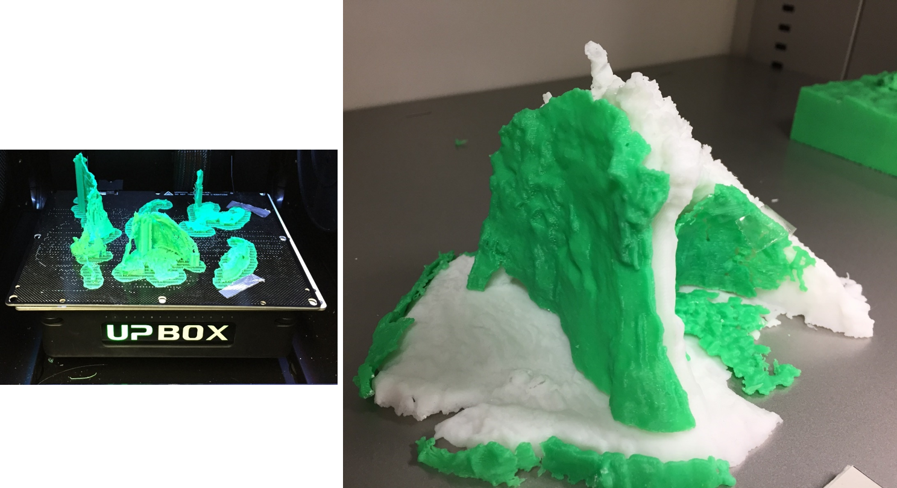

 *地形の3Dプリントの例* 

#### データソース
本教材で利用したデータは、[Resources]()に別途まとめています。運用者が自作したデータは、無償でダウンロードできます。